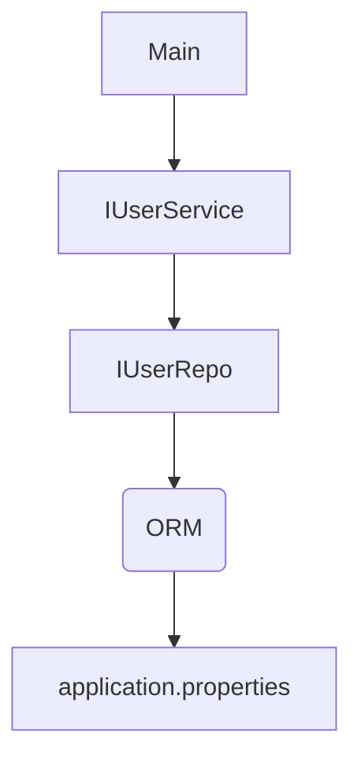

### [To Referenced Video Click Here](https://youtu.be/JL33j0uey80?si=xxVtKb9l3ia8gMXz)

#### Package structure

- com.example.testjpa - main
- com.example.testjpa.exception - error handling
- com.example.testjpa.model - data models
- com.example.testjpa.repository - database calling classes
- com.example.testjpa.service - service layer

### [Initialized Spring Boot](https://start.spring.io/)

1. Selected Project as `Maven`

2. Selected Language as `Java`

3. Selected Spring Boot as `3.2.0`

4. Selected Packaging as `Jav`

5. Selectd Java as `17`

6. Renamed the Artifact as `test-jpa`

7. Click Genarate button to add Dependencies

- Spring web
- Lombok - use to avoid boilerplate code
  - `eg:- constructors,getter,setter,toString,etc...`
  - [More details](https://youtu.be/8miKAvf9UaI?si=JtTVxHCNKXNwIeja)
- MySQL Driver
- Spring Data JPA

### In JPA

